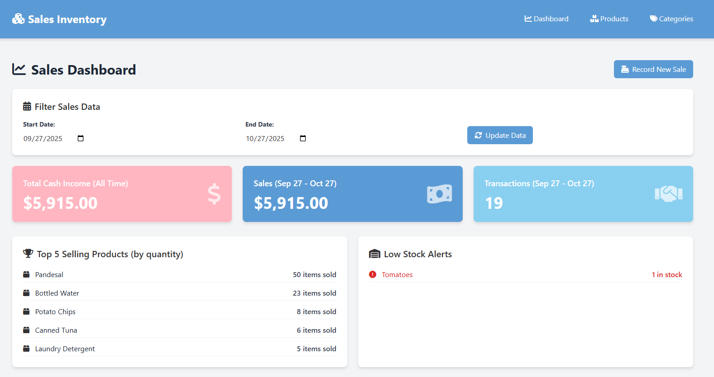
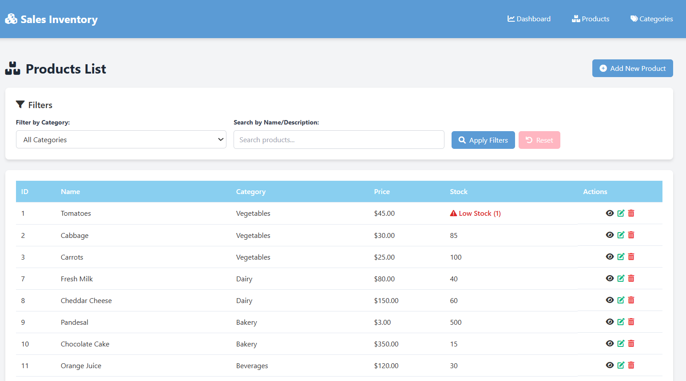
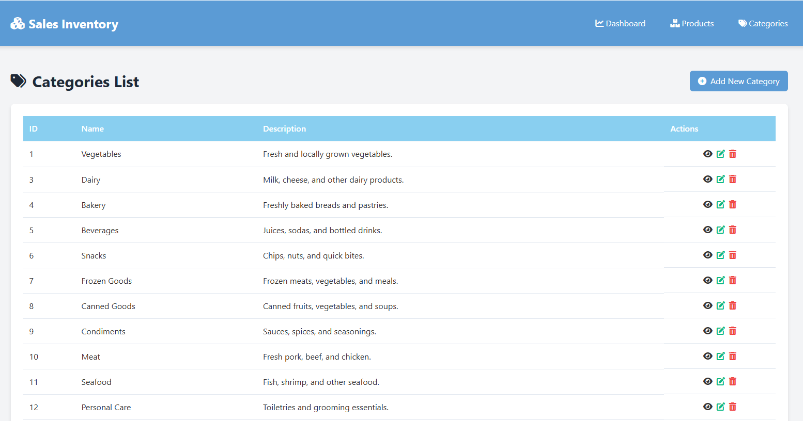

# Dashboard Overview


# Products Tab Overview


# Categories Tab Overview



## 1. Create Local Repository

**Command:**

```bash
git init
```

**Description:**
Initializes a new Git repository in your current project folder. This creates a hidden `.git` directory that tracks all changes.

---

## 2. Add Files to Staging Area

**Command:**

```bash
git add .
```

**Description:**
Adds all files in your project to the staging area, preparing them for commit.

---

## 3. Commit Changes

**Command:**

```bash
git commit -m "Initial commit"
```

**Description:**
Records the staged changes in your local repository with a descriptive message.

---

## 4. Configure User Identity

**Commands:**

```bash
git config --global user.name "Your Name"
git config --global user.email "your@email.com"
```

**Description:**
Sets your username and email so Git can record who made each commit.

---

## 5. Connect to Remote Repository

**Command:**

```bash
git remote add origin https://github.com/yourusername/midterm-collab.git
```

**Description:**
Connects your local repository to a remote GitHub repository named `midterm-collab`.

---

## 6. Rename and Push Main Branch

**Commands:**

```bash
git branch -M main
git push -u origin main
```

**Description:**
Renames your branch to `main` and pushes your commits to GitHub, linking your local branch to the remote one.

---

## 7. Clone Repository (Partner’s Repo)

**Command:**

```bash
git clone https://github.com/partnerusername/partner-repo.git
```

**Description:**
Creates a copy of your partner’s repository on your local computer, including all files and version history.

---

## 8. Create and Switch Branch

**Command:**

```bash
git checkout -b feature-update
```

**Description:**
Creates a new branch named `feature-update` and switches to it immediately.

---

## 9. Make and Commit Changes in Branch

**Commands:**

```bash
# Edit your files as needed
git add .
git commit -m "Added new feature or updated content"
```

**Description:**
Stages your modified files and saves them with a commit message that describes the changes.

---

## 10. View and Compare Branches

**Commands:**

```bash
git branch
git diff main feature-update
```

**Description:**
Displays all branches in your repository and shows the differences between `main` and `feature-update`.

---

## 11. Merge Branch with Main

**Commands:**

```bash
git checkout main
git merge feature-update
```

**Description:**
Merges the `feature-update` branch into the `main` branch, combining both sets of work.

---

## 12. Delete a Branch After Merge

**Command:**

```bash
git branch -d feature-update
```

**Description:**
Deletes the merged branch from your local repository to keep it clean.

---

## 13. Fetch and Pull Updates from GitHub

**Commands:**

```bash
git fetch
git pull
```

**Description:**
`fetch` checks for changes from the remote repository, while `pull` downloads and applies them to your local branch.

---

## 14. View Remote Repository Information

**Command:**

```bash
git remote show origin
```

**Description:**
Displays details about your connected remote repository, such as fetch and push URLs.

---

## 15. Undo or Restore Changes

**Commands:**

```bash
git restore filename.txt
git reset --soft HEAD~1
git reset --hard HEAD~1
```

**Description:**
Restores files to their last saved state or undoes recent commits, depending on which command is used.

---


## **Project Title**

**Laravel Sales Inventory Management System (Midterm Project)**

---

## **Description / Overview**

This project is a **web-based Sales Inventory Management System** built using the **Laravel Framework**.
It helps businesses efficiently manage product inventories, track sales, and organize products into categories.
The system also includes a dashboard that provides real-time sales data and inventory insights.

---

## **Objectives**

1. Develop a full-stack CRUD application using **Laravel MVC architecture**.
2. Implement database modeling and migrations for inventory and transactions.
3. Build a **data-driven dashboard** to display sales metrics and low-stock alerts.
4. Demonstrate proficiency in Laravel’s **controllers, routes, and Blade views**.
5. Apply **Git and GitHub** for project version control and collaboration.

---

## **Features / Functionality**

### **Sales Dashboard**

* Filter sales data by **start** and **end** dates.
* Display key metrics such as **total income**, **sales**, and **transactions**.
* Show **top 5 selling products** and **low stock alerts**.
* Record new sales transactions.

### **Product Management**

* View, add, edit, and delete products.
* Filter products by category and search by name.
* View stock levels and get low-stock warnings.

### **Category Management**

* Add, view, edit, and delete product categories.
* Display category details such as ID, name, and description.

---

## **Installation Instructions**

1. **Clone the Repository**

   ```bash
   git clone https://github.com/MeshyRhime/mid-exam.git
   cd mid-exam
   ```

2. **Install PHP Dependencies**

   ```bash
   composer install
   ```

3. **Install JavaScript Dependencies**

   ```bash
   npm install
   ```

4. **Setup Environment**

   ```bash
   cp .env.example .env
   php artisan key:generate
   ```

   Edit the `.env` file to configure your database connection.

5. **Run Migrations**

   ```bash
   php artisan migrate --seed
   ```

6. **Compile Assets**

   ```bash
   npm run build
   ```

7. **Run the Server**

   ```bash
   php artisan serve
   ```

   The application will be accessible at [http://127.0.0.1:8000/dashboard](http://127.0.0.1:8000/dashboard).

---

## **Usage**

1. Access the **Dashboard** to view sales and inventory metrics.
2. Use the **Categories** section to organize products.
3. Manage **Products** by adding, editing, or deleting entries.
4. Monitor stock levels and check for low inventory warnings.

---

## **Author**

**Mezrhime Kyle B. Tangalin**

---

## **License**

This project is licensed under the **MIT License**.
© 2025 Mezrhime Kyle B. Tangalin

